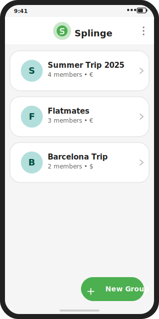
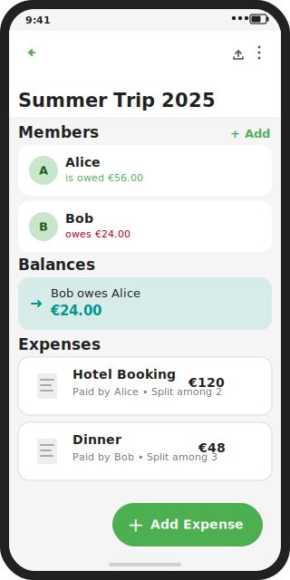
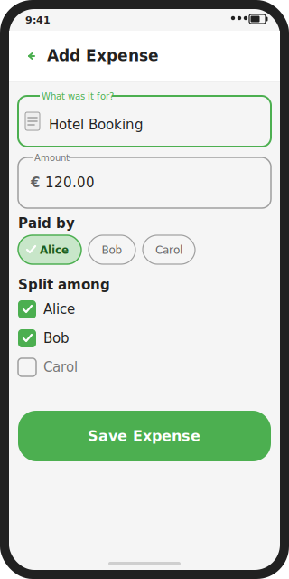
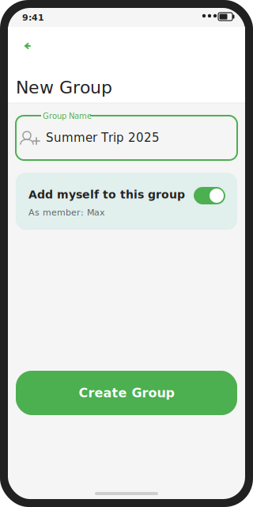
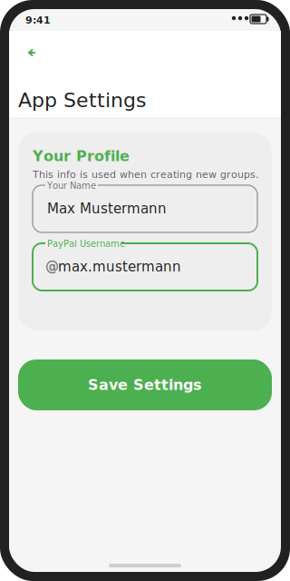

# Splinge - Split Expenses with Ease

[](LICENSE)
[](https://www.jetbrains.com/help/kotlin-multiplatform-dev/get-started.html)
[](CONTRIBUTING.md)

Splinge is a Kotlin Multiplatform application designed to help you split expenses among friends, family, or travel groups. It features a modern Compose Multiplatform UI and works seamlessly on both Android and iOS.

## Screenshots

| Groups | Group Detail | Add Expense | New Group | App Settings |
|:---:|:---:|:---:|:---:|:---:|
|  |  |  |  |  |
| All groups with initial-letter avatar, member count & currency | Members + balances (green/red), debt transactions & expense list | OutlinedTextFields, Paid-by FilterChips, split checkboxes | Group name field + "Add myself" toggle switch | Profile name & PayPal username saved to local DB |

## Features

- **Group Management**: Create multiple groups for different trips or occasions.
- **Expense Tracking**: Add expenses, specify who paid, and who the expense was for.
- **Flexible Splitting**: Split expenses equally among group members.
- **Smart Debt Simplification**: Choose between basic splitting and a "Smart" algorithm that minimizes the number of transactions needed to settle up.
- **Multi-Currency Support**: Set different currencies (€, $, £) for each group.
- **PayPal Integration**: Quickly open PayPal 'Scan Me' links to settle debts.
- **Report Sharing**: Generate and share detailed expense reports via system share sheets.
- **Dark Mode Support**: Full support for system dark and light themes.

## Project Structure

This is a Kotlin Multiplatform project targeting Android and iOS.

```
composeApp/src/commonMain/kotlin/org/oltionzefi/splinge/
├── model/          # Data classes: Group, Member, Expense, Split, Transaction
├── logic/          # Pure business logic: SplitCalculator
├── navigation/     # Screen sealed class (all app destinations)
├── ui/
│   ├── components/ # Reusable Composables (dialogs, …)
│   ├── screens/    # Full-screen Composables (one file per screen)
│   └── theme/      # SplingeTheme, colour schemes
└── util/           # Stateless helpers: ShareUtil, number formatting
```

* [`composeApp/src/androidMain/`](./composeApp/src/androidMain/kotlin) — Android entry point (`MainActivity`) and `Platform` implementation.
* [`composeApp/src/iosMain/`](./composeApp/src/iosMain/kotlin) — iOS entry point (`MainViewController`) and `Platform` implementation.
* [`iosApp/`](./iosApp/iosApp) — Xcode project and SwiftUI wrapper for the shared Compose UI.

## Prerequisites

- **JDK**: Java 21 is required to build the project.
- **iOS**: A full installation of **Xcode** is required for Kotlin/Native and iOS-specific tasks. Command Line Tools are not sufficient.

## Build and Run

### Android

```shell
# macOS / Linux
./gradlew :composeApp:assembleDebug

# Windows
.\gradlew.bat :composeApp:assembleDebug
```

### iOS

Open the [`iosApp/`](./iosApp) directory in Xcode and run, or use the IDE run configuration.

## Contributing

Contributions are welcome! Please read [CONTRIBUTING.md](CONTRIBUTING.md) for guidelines on branching, code style, and how to add new screens.

## Changelog

See [CHANGELOG.md](CHANGELOG.md) for a history of notable changes.

## License

Splinge is released under the [MIT License](LICENSE).

---

Learn more about [Kotlin Multiplatform](https://www.jetbrains.com/help/kotlin-multiplatform-dev/get-started.html).
